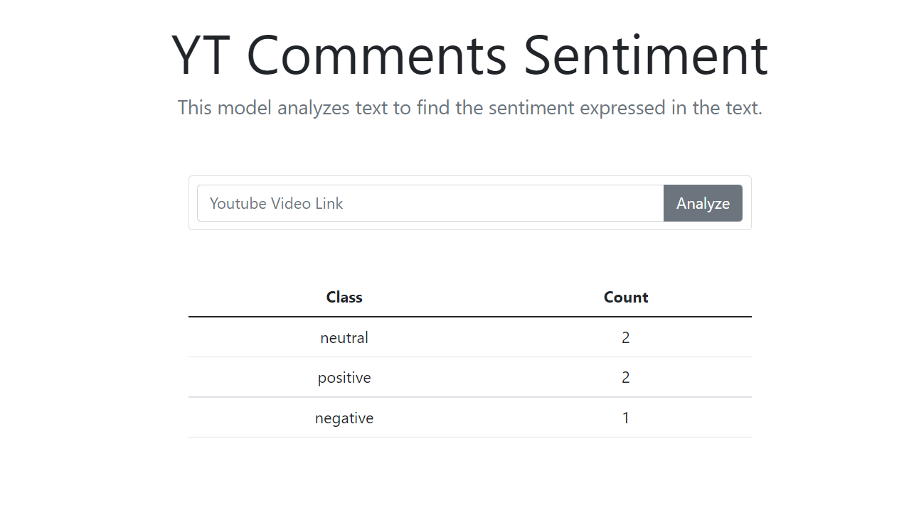

# YT-comment-sentiment

## Steps
- create a API key for to get YouTube comment -https://console.cloud.google.com/apis
- I used Modzy API for sentiment analysis

### YouTube Demo -https://youtu.be/C0Nyo2hbi1c

## Resources

[Docs](https://www.modzy.com/developers/?utm_source=devpost&utm_medium=webpage&utm_term=developer-resources&utm_content=landing+page&utm_campaign=Hackathon)

[Modzy Flask Quick Start](https://docs.modzy.com/docs/modzy-in-a-flask-app-quickstart)
